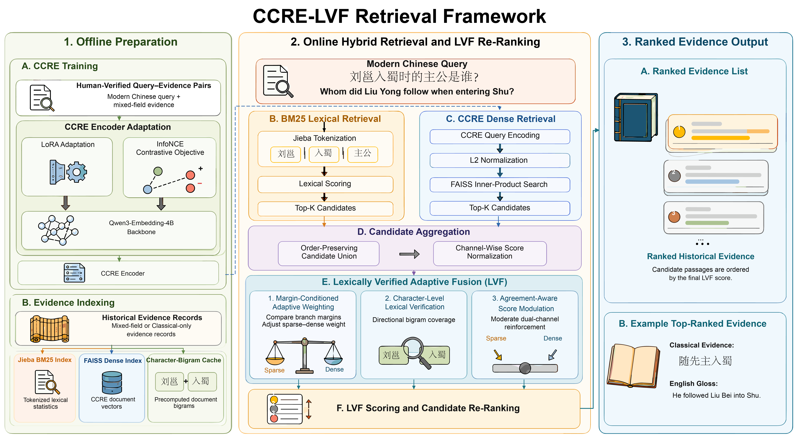

# CCRE-LVF

Official code release for:

> **CCRE-LVF: Domain-Adapted Dense Retrieval with Lexically Verified Adaptive Fusion for Modern-to-Classical Chinese Historical Retrieval**

This repository contains the implementation used for the paper's CCRE encoder adaptation, BM25 lexical retrieval, dense retrieval, candidate aggregation, LVF fusion, ablation studies, cross-dataset evaluation, and supplementary analyses.

## Framework



**Figure 1.** Overview of the CCRE-LVF pipeline, including offline CCRE adaptation and evidence indexing, online BM25/dense candidate retrieval, candidate aggregation, LVF fusion, and ranked evidence output.

## Method at a Glance

For a query `q` and candidate document `d`, LVF uses

```text
LVF(d) = alpha(q) * s_b(d) + (1 - alpha(q)) * s_v(d) + gamma * L(d) - delta * P(d)
```

where `s_b` and `s_v` are min-max normalized BM25 and dense-retrieval scores, `alpha(q)` is a query-adaptive weight based on the two retrieval margins, `L(d)` is character-bigram overlap, and `P(d)` is the cross-channel score product. The implementation uses `np.sort` for margin computation; the sorting step therefore has complexity `O(|C_q| log |C_q|)` for a candidate set `C_q`.

## Repository Layout

```text
CCRE_LVF_code_release/
├── README.md
├── CITATION.cff
├── LICENSE
├── requirements.txt
├── .gitignore
├── figures/
│   └── CCRE_LVF_retrieval_framework.png
├── code/
│   ├── lvf_algorithm.py              # Core LVF implementation and baselines
│   ├── train_encoder.py              # LoRA fine-tuning entry point
│   ├── retrieval_experiment.py       # Main retrieval experiment
│   ├── ablation_experiment.py        # LVF component ablations
│   ├── supplementary_analysis.py     # Supplementary analyses
│   └── evaluation.py                 # Standalone ranking evaluation
├── data/
│   ├── README.md                     # Dataset access and schema
│   └── dataset_description.md        # Dataset and split description
```

Only the core method, final experiment scripts, and essential documentation are included here. Raw datasets, model checkpoints, vector caches, intermediate scripts, result files, and private manuscript files are intentionally not bundled.

## Environment

- Python 3.10 or 3.11 is recommended.
- CUDA is required for encoder LoRA training and GPU encoding.
- CPU execution is sufficient for the standalone `lvf_algorithm.py` functions and small unit-style examples.

Create an environment and install the dependencies:

```bash
python -m venv .venv
source .venv/bin/activate       # Windows: .venv\Scripts\activate
python -m pip install --upgrade pip
python -m pip install -r requirements.txt
```

For GPU runs, install the PyTorch build matching the local CUDA version before installing the remaining packages. The exact CUDA build is hardware- and driver-dependent.

## Data and Model Checkpoints

The dataset is not redistributed in this repository. Download it from the following placeholder and replace the URL before public release:

**Dataset:** <https://huggingface.co/datasets/YOUR-ORG/CCRE-LVF-Dataset>

The experiments require a base encoder and an adapted checkpoint. Model paths are defined near the top of the experiment scripts as placeholders. Replace them with paths on your machine, or expose an equivalent directory structure before running.

## Quick Start: Core LVF

The core implementation has no dataset or model dependency:

```python
import numpy as np
from lvf_algorithm import lvf_fusion, precompute_bigrams

documents = ["古文文档一", "古文文档二"]
queries = ["现代文查询"]
doc_bigrams = precompute_bigrams(documents)

ranked = lvf_fusion(
    bm25_indices, bm25_scores,
    vec_indices, vec_scores,
    queries, doc_bigrams,
    alpha_base=0.4, alpha_range=0.10,
    alpha_scale=20, gamma=0.3, delta=0.2,
    top_k=100,
)
```

Run the snippet from the `code/` directory, or set `PYTHONPATH=code` from the repository root.

The public API also includes `was_hybrid` (fixed-alpha weighted fusion) and `rrf_fusion` (reciprocal rank fusion) for baseline comparisons.

## Reproducing the Paper Experiments

After downloading the data and checkpoints and updating the path constants in the scripts:

```bash
# Train the encoder adapter (GPU)
python code/train_encoder.py

# Main retrieval experiment
python code/retrieval_experiment.py

# LVF ablation experiment
python code/ablation_experiment.py

# Supplementary analysis
python code/supplementary_analysis.py

# Evaluate saved rankings (JSON or NPY)
python code/evaluation.py \
  --rankings path/to/rankings.json \
  --relevant path/to/relevant_indices.json \
  --k 1 5 10 \
  --output metrics.json
```

The experiment scripts read JSON/JSONL data and optional embedding caches, then write JSON summaries to the configured output directory. Set `CCRE_LVF_ROOT` or override the command-line paths before running.

## Experimental Defaults

| Setting | Value |
| --- | --- |
| BM25 tokenizer | Jieba |
| BM25 candidates | 100 |
| Dense index | FAISS `IndexFlatIP` |
| Candidate fusion | Order-preserving union, channel-wise min-max normalization |
| `alpha_base` | 0.4 |
| `alpha_range` | 0.10 |
| `alpha_scale` | 20 |
| `gamma` | 0.3 |
| `delta` | 0.2 |
| RRF baseline | `k = 60` |
| Random seed | 42 |

The main evaluation reports Recall@1/5/10 and MRR; supplementary scripts additionally compute nDCG@10, paired significance tests, efficiency, hyperparameter sensitivity, RRF-k comparisons, and case studies.

The standalone evaluator accepts one ranked document-index list per query and either one relevant document index or a list of relevant indices per query.

## Reproducibility Notes

1. Keep the documented random seed (`42`) and the paper's dataset sampling ratios.
2. Use the same model revision and tokenizer for each comparison.
3. Preserve the candidate cutoff (`top_k=100`) before fusion.
4. Do not use test labels when fitting auxiliary baselines.
5. Record GPU model, CUDA version, package versions, and checkpoint identifiers in the final public release.

## Citation

Please cite the paper after publication. A placeholder BibTeX entry is included below and in [`CITATION.cff`](CITATION.cff):

```bibtex
@article{REPLACE_WITH_CITATION_KEY,
  title   = {CCRE-LVF: Domain-Adapted Dense Retrieval with Lexically Verified Adaptive Fusion for Modern-to-Classical Chinese Historical Retrieval},
  author  = {REPLACE WITH AUTHORS},
  journal = {REPLACE WITH JOURNAL},
  year    = {2026},
  doi     = {REPLACE WITH DOI}
}
```

## License and Data Use

The license is intentionally left as a placeholder in [`LICENSE`](LICENSE) and must be selected by the authors before the repository is made public. Dataset and pretrained-model terms remain governed by their original providers' licenses. Users are responsible for checking copyright, privacy, and redistribution conditions for historical texts and derived annotations.

## Contact

Replace this section with the corresponding author email, project webpage, and issue-reporting instructions before submission or public release.
